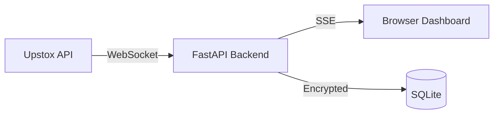

# Upstox Live Trading Dashboard 🚀

A real-time market data dashboard built with FastAPI, SSE (Server-Sent Events), and Upstox V3 SDK.

## Architecture


## Prerequisites
- Upstox Developer Account
- An app created in the [Upstox Developer Console](https://developer.upstox.com/)
- **Redirect URI**: `http://127.0.0.1:5001/callback` (or your local port)

## Setup
1. **Clone the repository**:
   ```bash
   git clone https://github.com/untitledengineering/vibe-coded-trading-bot.git
   cd vibe-coded-trading-bot
   ```

2. **Configure Environment**:
   ```bash
   cp example.env .env
   # Open .env and fill in:
   # UPSTOX_API_KEY=...
   # UPSTOX_API_SECRET=...
   # TOKEN_ENCRYPTION_KEY= (Generate with: python -c "from cryptography.fernet import Fernet; print(Fernet.generate_key().decode())")
   ```

3. **Launch with Docker**:
   ```bash
   docker compose up --build
   ```
   Access the dashboard at [http://127.0.0.1:5001](http://127.0.0.1:5001)

## Project Structure
```text
.
├── src/
│   ├── api/            # OAuth and SSE Stream handlers
│   ├── db/             # SQLite and Fernet encryption
│   ├── static/         # Dashboard UI (HTML/CSS/JS)
│   ├── utils/          # Logger and Config
│   └── main.py         # Application entry point
├── tests/              # Unit tests for all components
├── Dockerfile          # Multi-stage build
├── docker-compose.yml  # Service definition
└── requirements.txt    # Python dependencies
```

## Running Tests
Ensure you have the dependencies installed locally:
```bash
pytest -v
```

## Disclaimer
> [!CAUTION]
> This project is for **educational and paper trading purposes only**. It is **not** financial advice. The authors are not SEBI-registered advisors. Use at your own risk.
